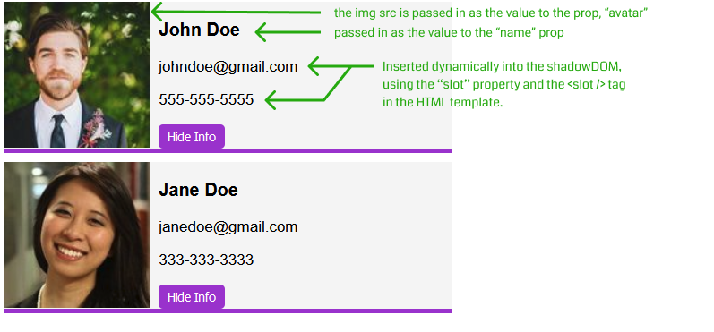

# Web Components Practice Example 
Simple walkthrough of Travery's Web Components Crash Course. Builds a reuable `<user-card>` component that takes a `name` and an `avatar` prop. It also makes use of the `slot` property on our `p` tag elements to dynamically pass in data to our template, in this case phone numbers and email.
 
## Project Preview 

## Key Takeways/Thoughts
- Web components are really cool, and feel very familiar if you've ever worked with React/Vue.
- Interesting to note that with the introduction of hooks/context API in react and the "in vogueness" of FP, that you have the landscape shifting to a more functional/pure components approach, relying less on class based ones. No matter, I think this is still pretty clean/elegant and decently readable. Learning web components is kind of like seeing how the sausage is/can be made with React and how powerful the concept of a virtual/shadow DOM can be.
- When we are creating a new web component class, the first thing we need to do is call `super()` within our constructor to extend the features of the HTMLElement parent class.
- We use `window.customElements.define('tag-name', className);` to make the connection between our class and our custom web component/tag. 
- We need to create a shadowDOM if we want tigher encapsulation of our markup and styles, we do so by saying `Element.attachShadow()`, where Element, within our component is going to be reference with they `this` keyword. 
  - `attachShadow` takes in a dictionary/object, there are two avaiable properties in this dictionary, but for the most part, we just need to specify `mode` and set its value to `open` to allow this DOM to be accessed by JS. 
- `this.shadowRoot.appendChild(template.content.cloneNode(true))` We can now access the shadowDOM `this.shadowRoot`. The first we would want to do is append to the shadowDOM an HTML template of our component. We do this using `appendChild` and pass in the template content where `template` is the HTMLL template we would still need to create. We use `.cloneNode(true)` to say we want to clone the node tree of the provided HTML template content. 
- We can now access the tags in our template using query selectors on our shadowRoot like we would an HTML document/DOM. e.g.`this.shadowRoot.querySelector('h3').innerText = this.getAttribute('name');`. We are setting the innerText of the h3 in the shadowDOM that we cloned from our template. We can now modify things in that shadowDOM for instance the `.innerText` on the selected h3 set to the prop we are passing into the custom component.
- Slots are just placeholders for markup we can dynamically pass into our template. 
  - `<slot />` tags are used in our template as the placeholder for data/markup we provided in our markup.
  - The way we provide the data/markup to the slot placeholder is by specifying the `slot` property of a wrapping HTML tag.
- We add functionality/events to our web components using lifecyle methods like...
  - `constructor()`: called when an instance of the element is created or upgraded 
  - state initialization for example.
  - `connectedCallback()`: Called every time when the element is inserted into the DOM 
  - `disconnectedCallback()`: Called everyy time the element is removed from the DOM 
  - `attributeChangedCallback(attributeName, oldValue, newValue)`: Called when an attribute is added, removed, updated, or replaced 
    - because when we have custom classes we can listen for attribute changes much like we would have props in React
- For most events like adding event listeners we can use the `connectedCallback()` method like so... 
```js
  //...
  connectedCallback() {
      this.shadowRoot.querySelector('#toggle-info').addEventListener('click', () =>
        this.toggleInfo() //we can definew toggleInfo as a method in this class.
      );
  }
```
- It's very much like adding normal event handlers but we are targeting the shadowDOM or specific elements in our shadow DOM to attach the event listeners to.
